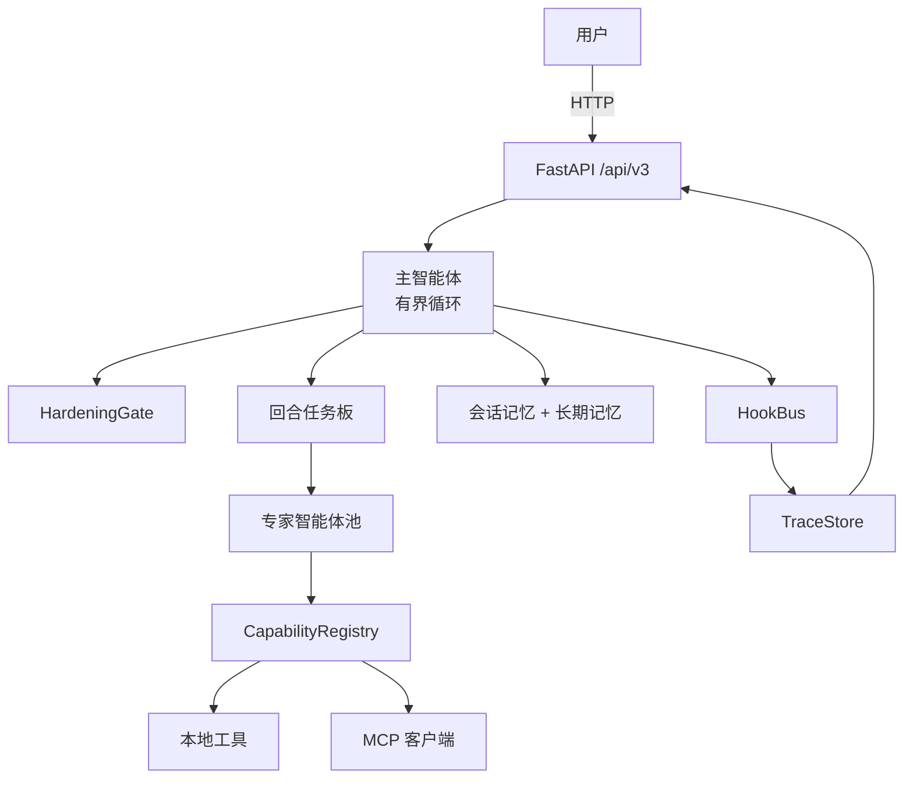

# 可审计的动态智能体（V3）

V3 是一个中心化多智能体运行时原型。用户只与主智能体（Main Agent）交互，专家智能体、工具和 MCP 能力统一通过 `CapabilityRegistry` 注册与调度；每个回合都在 `observe -> decide -> act -> observe` 的有界循环内推进，并把决策、调用、观测、降级和指标写入可审计链路。

当前仓库以电商导购作为验证场景，但重点不是“推荐耳机”本身，而是验证一套可控、可替换、可追踪的 Agent Runtime：主智能体只负责决策、边界、审计和编排，RAG、库存、文案、推荐、观测和远期交易等业务能力作为“外接手臂”接入。

## 快速理解

| 维度 | 说明 |
|---|---|
| 项目定位 | 一个可审计、可约束、可替换的多智能体运行时，而不是单纯的推荐聊天机器人 |
| 主执行模型 | 单主智能体入口，回合内串行有界循环，所有动作都落到结构化 `Action` |
| 协作控制 | `CollaborationRouter` 先定动作类型，LLM 只补参数、brief 和回复文案 |
| 能力接入 | 本地工具、专家智能体、MCP 工具统一注册到 `CapabilityRegistry` |
| 安全与审计 | `HardeningGate` 负责门禁，`TraceStore` 和观测系统负责链路记录 |
| 当前边界 | 现阶段验证导购运行时，不直接代下单，不接真实交易系统 |

## 核心亮点

| 方向 | 实现 |
|---|---|
| 运行时控制 | 单主智能体入口 + 串行有界循环，避免无界工具调用 |
| 确定性协作路由 | 同样上下文下稳定决定是澄清、调工具、调子智能体、回复还是降级 |
| 能力外接 | 工具、专家智能体和 MCP 工具走统一注册、统一调用、统一审计链路 |
| 安全边界 | `HardeningGate` 覆盖动作白名单、Schema、证据引用和业务边界 |
| 显式记忆 | 长期记忆只接受 `source=user_confirmed`，偏好支持查看和撤销 |
| 可观测性 | Trace、结构化日志、HookBus 和 `observability_metrics_query` 形成完整链路 |
| 本地演示 | 无真实 LLM 密钥时自动进入 mock 模式，可直接通过 `/ui` 复现 |

## 快速开始

下面示例使用 Windows PowerShell；如果你在 macOS / Linux 上运行，请将 `.\.venv\Scripts\python.exe` 替换为 `.venv/bin/python`。

1. 创建虚拟环境并安装依赖。

```powershell
python -m venv .venv
.\.venv\Scripts\python.exe -m pip install -U pip
.\.venv\Scripts\python.exe -m pip install -r requirements.txt
```

2. 启动 API 服务。

```powershell
.\.venv\Scripts\python.exe -m uvicorn app.main:app --host 127.0.0.1 --port 8000
```

3. 打开本地演示界面。

- UI: `http://127.0.0.1:8000/ui`
- 健康检查: `http://127.0.0.1:8000/health`
- API 文档: `http://127.0.0.1:8000/docs`

4. 生成一组可截图的观测数据。

```powershell
.\.venv\Scripts\python.exe scripts\run_observability_demo.py
```

脚本会自动创建会话、运行 V3.1 Lite 演示、提交两条模拟推荐反馈，并输出平均耗时、能力调用数、RAG 调用次数、fallback 数和兴趣率。

### 配置项

配置从 `.env` 读取，环境变量统一使用 `ECOV3_` 前缀，常用项包括 `ECOV3_OPENAI_API_KEY`、`ECOV3_OPENAI_BASE_URL`、`ECOV3_OPENAI_MODEL` 和 `ECOV3_MCP_MOCK_ENABLED`。

如果 `ECOV3_OPENAI_API_KEY` 为空，应用会自动使用内置模拟响应，因此 UI、冒烟测试和观测脚本都可在本地运行。

## 演示路径

| 场景 | 示例输入或操作 | 验证点 |
|---|---|---|
| 完整推荐链路 | `1500 内通勤降噪耳机` | 多步专家智能体协作，并输出可追踪的推荐结果 |
| 澄清追问 | `给朋友挑礼物` | 主智能体会在关键信息缺失时先追问约束，再继续行动 |
| 边界降级 | `帮我下单` | `HardeningGate` 拦截超出当前业务边界的下单请求 |
| 偏好档案 | 在对话中提到预算、使用场景、排斥品牌 | 显式偏好会投影到侧边栏，并支持用户撤销 |
| V3.1 Lite | `V3.1 演示：根据我的通勤耳机偏好，召回商品、查库存、生成首页推荐文案` | 串行调用商品召回、库存、RAG、偏好状态建议和首页文案生成能力 |
| MCP 观测数据 | 运行自测脚本，或在 UI 中点击推荐反馈 | `observability_metrics_query` 返回平均耗时、能力调用分布、fallback 数和会话级兴趣率 |

## 架构概览



核心设计文档见 [docs/architecture.md](docs/architecture.md)；完整行为规范见 [docs/app_spec.md](docs/app_spec.md)。

## 系统工作方式

第一次阅读这个项目，建议先把它理解成“一个带门禁和审计的回合执行器”，而不是一个直接把 Prompt 接到工具上的聊天机器人。一轮请求的主流程如下：

1. API 接收用户消息，并先把预算、品类、场景、排斥品牌等 `user_confirmed` 信息写入会话级偏好状态。
2. Runtime 把 `SessionState`、偏好状态、最近 observation 和任务板压缩成 `ContextPacket`。
3. `CollaborationRouter` 先决定当前回合的固定动作类型，LLM 只补参数、brief 和回复文案。
4. `HardeningGate` 做动作白名单、Schema、证据引用和业务边界校验。
5. `SerialExecutor` 串行执行工具或子智能体调用，把任务状态、调用记录和 observation 写入 Trace，最终返回 `TurnResult` 与 `trace_id`。

## 能力外接模型

V3 不要求主智能体直接实现所有业务能力。主智能体只做四件事：选择下一步动作、检查业务边界、记录审计追踪、编排能力调用。具体业务能力以“外接手臂”的形式接入，并通过结构声明、权限声明和观测结果与运行时对接。

| 能力 | 类型 | 当前作用 | 可替换方向 |
|---|---|---|---|
| `catalog_search` | 本地工具 | 商品查库 / 商品召回 | 搜索服务 / 推荐召回服务 |
| `inventory_check` | 本地工具 | 查询 SKU 库存状态 | 库存系统 API |
| `product_compare` | 本地工具 | 商品维度对比 | 商品比较服务 |
| `rag_product_knowledge` | MCP 工具 | MCP 风格商品知识召回 / RAG | 外部 Modular RAG MCP Server |
| `observability_metrics_query` | MCP 工具 | 查询会话级运行时指标和推荐反馈指标 | 观测平台 / 指标服务 / Prometheus Adapter |
| `preference_profile_update` | 本地工具 | 生成可审计的显式偏好状态更新建议，不直接写长期记忆 | 用户偏好服务 / 实验平台 |
| `marketing_copy_generate` | 本地工具 | 基于商品和偏好快照生成首页推荐位 / 广告位文案 | 文案生成服务 / A/B 测试平台 |
| `transaction_execute` | 远期能力 | 当前不支持，`HardeningGate` 拦截下单 | 受控交易 MCP / 订单编排服务 |

当前 V3.1 Lite 已证明这些外接能力可以被统一注册、调用和审计；完整受控扇出、结果汇聚和树形 Trace 留给 V3.1 正式版。

## 子智能体协作协议

当前实现不是“主智能体自由发挥要不要调子智能体”，而是先走一层确定性协作路由。`MainAgent` 在调用 LLM 前会先执行 `CollaborationRouter.route(context)`，根据同一份上下文计算固定的 `required_action_kind`。LLM 仍然负责补全工具参数、specialist brief 和最终文案，但不能改变动作类型。

当前决策流程是固定的：

1. 主智能体读取当前上下文、已有 observation 和会话约束。
2. `CollaborationRouter` 先产出 `route_key`、`required_action_kind` 和安全默认动作。
3. LLM 在 prompt 中看到 `collaboration_route`，只补全当前动作所需参数。
4. 如果 LLM 返回的 `action.kind` 不符合路由要求，系统自动改写为路由给出的安全动作，并在 `routing_metadata` 中记录 `route_result=rewrite`。
5. 改写后的动作再进入 `HardeningGate` 做最终校验。

这样可以保证同样上下文下，系统稳定地走同一种动作类型，而不是一轮调子智能体、一轮又改成直接回复。

| 场景 | 固定动作类型 | 当前实现 |
|---|---|---|
| 越界请求 | `fallback` | 下单、支付、账户、售后等请求直接降级 |
| 约束不足的购物请求 | `ask_clarification` | 缺少预算、品类或使用场景时先追问 |
| 普通购物请求 | `call_tool -> reply_to_user` | 先做确定性商品召回，再基于 observation 回复 |
| V3.1 Lite 演示链路 | 固定 `call_tool` 序列 | `catalog_search -> inventory_check -> rag_product_knowledge -> preference_profile_update -> marketing_copy_generate -> reply_to_user` |
| 完整推荐链路 | 固定 `call_sub_agent` 序列 | `shopping_brief_specialist -> candidate_analysis_specialist -> comparison_specialist -> recommendation_rationale_specialist -> reply_to_user` |

子智能体和工具调用进入同一套结构化执行协议，而不是和用户消息混在一起。当前落地的协议主干包括：

| 协议字段 | 作用 |
|---|---|
| `task_id` | 对应回合任务板中的结构化任务 |
| `capability_name` | 指向 `CapabilityRegistry` 中注册的工具、MCP 工具或专家智能体 |
| `status` | 表达 `pending`、`running`、`succeeded`、`failed` 等生命周期状态 |
| `input_schema` / `output_schema` | 限定请求和响应结构，避免只靠自然语言解释 |
| `observation_id` | 把工具或子智能体输出接入证据引用和最终回复 |
| `routing_metadata` | 记录 `route_key`、`required_action_kind`、`actual_action_kind` 和 `route_result` |

子智能体调用的可观测性由三层组成：`TraceStore` 记录每次 decision / invocation / observation，HookBus 输出结构化事件，`observability_metrics_query` 汇总会话级指标。录制演示时，可以在 Trace 面板看到每次能力调用，在观测面板看到能力调用分布、平均耗时、fallback 数和反馈指标。

更通用的跨 Agent `request_id` 消息协议和受控 fan-out 状态表仍属于后续版本演进，不在当前 V3.1 Lite 已实现范围内。

## 观测系统

内置 MCP 观测系统由 `observability_metrics_query` 提供，当前采用 in-process MCP 模拟实现。它不会侵入主智能体决策逻辑，而是从 Trace 和推荐反馈事件中汇总会话级指标。

| 指标类型 | 内容 |
|---|---|
| 运行时指标 | turn 数、平均耗时、决策数、能力调用数、观测数、fallback 数、guardrail 命中数 |
| 能力分布 | `catalog_search`、`inventory_check`、`rag_product_knowledge` 等能力调用次数 |
| 推荐反馈 | `interested`、`not_interested`、`clicked`、`ignored` 四类会话级反馈事件 |
| 反馈策略 | 只进入会话级指标，不直接写长期记忆，不声称是真实线上 CTR/CVR |

## 核心运行对象

下面这几个对象是理解 V3 的最短路径：

| 对象 | 作用 | 关键字段 |
|---|---|---|
| `SessionState` | 会话生命周期状态 | `session_working_memory`、`durable_user_memory`、`last_turn_status` |
| `ContextPacket` | 当前回合给主智能体看的压缩上下文 | `active_constraints`、`confirmed_preferences`、`recent_observation_ids` |
| `AgentDecision` | 主智能体某一步的结构化决策 | `action`、`rationale`、`routing_metadata` |
| `Observation` | 工具或子智能体返回的证据对象 | `observation_id`、`source`、`summary`、`payload` |
| `TraceRecord` | 单回合的完整审计链路 | `decisions`、`invocations`、`observations`、`fallback_reason` |
| `TurnResult` | API 返回给前端的回合结果 | `status`、`message`、`trace_id`、`completed_steps` |

## API 概览

| 方法 | 路径 | 说明 |
|---|---|---|
| `POST` | `/api/v3/sessions` | 创建会话 |
| `POST` | `/api/v3/sessions/{id}/messages` | 驱动一个回合，返回助手回复和 Trace 元数据 |
| `GET` | `/api/v3/sessions/{id}/turns/{n}/trace` | 读取某个回合的完整 Trace |
| `GET` | `/api/v3/sessions/{id}/preferences` | 读取当前会话合并后的偏好档案 |
| `POST` | `/api/v3/sessions/{id}/preferences/revoke` | 撤销一条偏好并触发 `memory_write` revoke 事件 |
| `GET` | `/api/v3/sessions/{id}/personalized_picks` | 基于当前偏好档案返回个性化商品卡片 |
| `GET` | `/api/v3/sessions/{id}/observability` | 通过内置 MCP 观测工具返回会话级运行时指标和推荐反馈指标 |
| `POST` | `/api/v3/sessions/{id}/recommendation_feedback` | 记录推荐卡片反馈事件，只更新会话级指标，不写长期记忆 |

### 关键返回结构

普通消息接口会返回一个 `TurnResult`，最常用字段如下：

```json
{
  "session_id": "session-xxx",
  "turn_number": 1,
  "status": "reply",
  "message": "Sony WH-1000XM5 更适合当前预算和通勤场景。",
  "trace_id": "trace-xxx",
  "completed_steps": 2
}
```

如果你要看“为什么这轮会调工具或调子智能体”，继续读取 `GET /api/v3/sessions/{id}/turns/{n}/trace`。这个接口会返回 `decisions`、`invocations`、`observations`、`guardrail_hits` 和 `fallback_reason`，适合直接做演示或排查。

如果你要看量化指标，读取 `GET /api/v3/sessions/{id}/observability`。这个接口聚合运行时指标和推荐反馈指标，适合截图或录视频展示。

## 项目结构

```text
app/
  main.py              FastAPI 入口
  v3/
    agents/            主智能体和 LLM 客户端
    api/               HTTP 路由和演示 UI
    config/            配置与环境变量加载
    hardening/         HardeningGate 校验
    hooks/             Hook 总线和挂载点
    memory/            会话记忆、长期记忆和偏好档案
    models/            核心 Pydantic 模型和动作类型
    observability/     JSON 日志、追踪上下文和指标存储
    prompts/           分层提示词注册
    registry/          能力注册表和 Provider 抽象
    runtime/           任务板、执行器和追踪存储
    specialists/       专家智能体实现
    tools/             本地工具和 MCP 集成
docs/                  架构和规格文档
scripts/               本地演示与自测脚本
tests/                 单元测试和冒烟测试
```

## 测试与验证

运行 V3 测试集：

```powershell
.\.venv\Scripts\python.exe -m pytest tests/v3 -q
```

当前覆盖包括：

- 模型、HardeningGate、记忆和运行时行为的单元测试
- 会话、追踪、偏好档案和推荐流程的 API 测试
- MCP 观测工具、运行时指标和推荐反馈指标测试
- 覆盖完整推荐链路、澄清追问、边界降级和完整专家链路的冒烟场景

最近一次完整验证结果：`166 passed`。

## 设计取舍

和常见的静态 DAG / 并行监督器方案相比，V3 更强调运行时可控性而不是吞吐量。

- 主智能体每一步实时决定下一步动作，而不是按预设 DAG 填槽执行
- 回合内任务保持串行，减少观测结果因果关系和证据引用的歧义
- 降级是一等运行时语义，不把越界请求和校验失败继续交给 LLM 兜底
- 记忆写入带门禁，避免把推断值升级成稳定用户事实
- MCP 观测系统先采用内置模拟实现，未来可替换成独立观测 MCP Server

## 路线图

- `V3.0`
  中心化主智能体、有界循环、固定专家智能体池、HardeningGate、记忆、MCP 集成和追踪存储
- `V3.1`
  为独立专家分支引入受控扇出和结果汇聚，同时保留门禁校验和可追踪性
- `V3.2+`
  在同一套运行时契约上扩展更复杂的多智能体编排能力，包括独立 MCP Server、持久化观测数据和后台任务系统

当前 V3.1 设计说明见 [docs/v3_1_fanout_design.md](docs/v3_1_fanout_design.md)。

## 未来演进：从对话运行时到推荐闭环

当前 V3 验证的是可审计智能体运行时的核心闭环。下一阶段可以扩展成“对话理解 -> 并行协作 -> 首页投影 -> 反馈更新”的完整推荐系统。

- 前台仍由主智能体与用户对话，并只收集用户明确表达的偏好状态
- 无前后依赖的任务通过受控扇出并行执行，例如偏好更新、商品查库、候选分析和运营文案生成
- 用户退出聊天页后，首页推荐位可根据本次会话的偏好快照生成商品卡片或广告文案
- 点击、收藏、明确感兴趣会提高偏好权重；不感兴趣、忽略或长期未点击会降低权重
- 只有用户确认或高置信重复反馈才进入长期记忆
- 交易执行类能力属于远期规划，必须建立在明确授权、权限校验、审计追踪和可回滚机制之上
- 后续可通过 A/B 测试比较不同文案策略、记忆写入策略和推荐排序策略

## 相关文档

推荐阅读顺序：

1. 先读本 README 的“核心亮点”“系统工作方式”“子智能体协作协议”，先建立整体心智模型。
2. 再读 [docs/architecture.md](docs/architecture.md)，看运行时分层、执行时序和设计取舍。
3. 再读 [docs/app_spec.md](docs/app_spec.md)，看产品目标、边界和版本范围。
4. 如果你关心后续演进，再读 [docs/v3_1_fanout_design.md](docs/v3_1_fanout_design.md)。

- [docs/architecture.md](docs/architecture.md)
- [docs/app_spec.md](docs/app_spec.md)
- [docs/v3_1_fanout_design.md](docs/v3_1_fanout_design.md)
