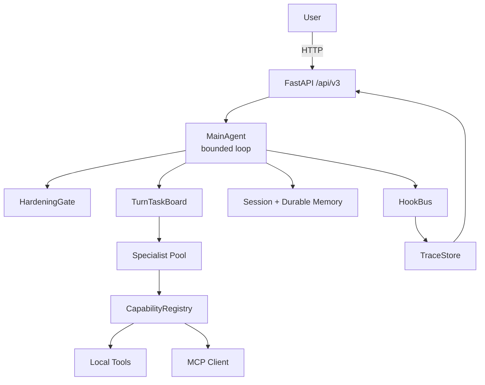

# 可审计的动态智能体运行时（V3）

V3 是一个按 Anthropic Harness 方法论构建的中心化多 Agent Runtime。用户只与 Main Agent 交互，Specialist、Tools 和 MCP 能力统一通过 CapabilityRegistry 调度；每个 turn 在 `observe -> decide -> act -> observe` 的 bounded loop 内推进，所有 decision、invocation、observation 和 fallback 都可追踪、可审计。

当前仓库以电商导购作为首个验证场景，但运行时本身是业务无关的，重点在于可控多步决策、权限边界和证据可追溯。

## 核心特性

- 单 Main Agent 入口，turn 内串行 bounded loop，避免无界工具调用
- HardeningGate 覆盖 action whitelist、schema validation、evidence rule 和 business boundary
- 两层 Memory 设计，durable 层只接受 `source=user_confirmed`
- 显式偏好档案，支持查看、撤销和基于偏好的个性化推荐
- TraceStore + 结构化日志，支持回放完整 turn 决策链
- CapabilityRegistry 统一注册本地工具、Specialist 和 MCP 能力
- 无真实 LLM key 时自动进入 demo mock 模式，可直接通过 `/ui` 演示

## 架构概览



核心设计文档见 [docs/architecture.md](docs/architecture.md)；完整行为规范见 [docs/app_spec.md](docs/app_spec.md)。

## 设计取舍

和常见的静态 DAG / 并行 Supervisor 方案相比，V3 更强调运行时可控性而不是吞吐量：

- Main Agent 每一步实时决定下一步 action，而不是按预设 DAG 填槽执行
- turn 内任务保持串行，减少 observation 因果关系和 evidence 引用的歧义
- fallback 是一等运行时语义，不把越界请求和校验失败继续交给 LLM 兜底
- Memory 写入带 gate，避免把推断值升级成稳定用户事实

## 快速开始

下面示例使用 Windows PowerShell；如果你在 macOS / Linux 上运行，请将 `.\.venv\Scripts\python.exe` 替换为 `.venv/bin/python`。

1. 创建虚拟环境并安装依赖。

```powershell
python -m venv .venv
.\.venv\Scripts\python.exe -m pip install -U pip
.\.venv\Scripts\python.exe -m pip install -r requirements.txt
```

2. 启动 API 服务。

```powershell
.\.venv\Scripts\python.exe -m uvicorn app.main:app --host 127.0.0.1 --port 8000
```

3. 打开本地演示界面。

- UI: `http://127.0.0.1:8000/ui`
- Health check: `http://127.0.0.1:8000/health`

### 配置项

Settings are loaded from `.env` with the `ECOV3_` prefix.

- `ECOV3_OPENAI_API_KEY`
- `ECOV3_OPENAI_BASE_URL`
- `ECOV3_OPENAI_MODEL`
- `ECOV3_MCP_MOCK_ENABLED`

If `ECOV3_OPENAI_API_KEY` is empty, the app installs built-in mock responses so the UI and smoke flows still work locally.

## 演示场景

仓库内置了几个可以直接通过 UI 或 HTTP API 运行的端到端场景：

| 场景 | 示例输入 | 验证点 |
|---|---|---|
| Happy Path | `1500 内通勤降噪耳机` | Multi-step specialist collaboration with traceable recommendation output |
| Clarification | `给朋友挑礼物` | Main Agent asks for missing constraints before acting |
| Fallback | `帮我下单` | HardeningGate blocks out-of-scope business actions |
| Preference Profile | Mention budget / scene / excluded brands in chat | Extracted preferences are projected to the side panel and can be revoked |

## API 概览

- `POST /api/v3/sessions`
  创建会话。
- `POST /api/v3/sessions/{id}/messages`
  驱动一个 turn，返回助手回复和 trace 元数据。
- `GET /api/v3/sessions/{id}/turns/{n}/trace`
  读取某个 turn 的完整 trace。
- `GET /api/v3/sessions/{id}/preferences`
  读取当前会话合并后的偏好档案。
- `POST /api/v3/sessions/{id}/preferences/revoke`
  撤销一条偏好并触发 `memory_write` revoke 事件。
- `GET /api/v3/sessions/{id}/personalized_picks`
  基于当前偏好档案返回个性化商品卡片。

## 项目结构

```text
app/
  main.py              FastAPI entrypoint
  v3/
    agents/            MainAgent and LLM client
    api/               HTTP routes and demo UI
    config/            Settings and environment loading
    hardening/         HardeningGate checks
    hooks/             Hook bus and hook points
    memory/            Session memory, durable memory, preference profile
    models/            Core Pydantic models and action types
    observability/     JSON logging and trace context
    prompts/           Layered prompt registry
    registry/          Capability registry and provider abstractions
    runtime/           Task board, executor, trace store
    specialists/       Specialist implementations
    tools/             Local tools and MCP integration
docs/                  Architecture and specification docs
tests/                 Unit and smoke tests
```

## 测试与验证

运行 V3 测试集：

```powershell
.\.venv\Scripts\python.exe -m pytest tests/v3 -q
```

当前覆盖包括：

- unit tests for models, hardening, memory and runtime behavior
- API tests for sessions, tracing, preferences and recommendation flows
- smoke scenarios for happy path, clarification, fallback and full specialist chain

## 路线图

- `V3.0`
  Centralized Main Agent, bounded loop, fixed specialist pool, hardening, memory, MCP integration and trace store
- `V3.1`
  Controlled fan-out and gather for independent specialist branches, while preserving gate checks and traceability
- `V3.2+`
  More advanced multi-agent orchestration capabilities on top of the same runtime contract

The current V3.1 design notes live in [docs/v3_1_fanout_design.md](docs/v3_1_fanout_design.md).

## 未来演进：从对话运行时到推荐闭环

当前 V3 验证的是可审计 Agent Runtime 的核心闭环。下一阶段可以扩展成“对话理解 -> 并行协作 -> 首页投影 -> 反馈更新”的完整推荐系统。

- 前台仍由 Main Agent 与用户对话，并只收集用户明确表达的偏好状态。
- 无前后依赖的任务通过受控 fan-out 并行执行，例如偏好更新、商品查库、候选分析和运营文案生成；每个分支独立过 HardeningGate，并写入 trace。
- 用户退出聊天页后，首页推荐位可根据本次会话的偏好快照生成商品卡片或广告文案。
- 点击、收藏、明确感兴趣会提高偏好权重；不感兴趣、忽略或长期未点击会降低权重。只有用户确认或高置信重复反馈才进入 durable memory。
- 交易执行类能力属于远期规划，必须建立在明确授权、权限校验、审计 trace 和可回滚机制之上；当前 V3 demo 保持导购边界，不直接代下单。
- 后续可通过 A/B 测试比较不同文案策略、记忆写入策略和推荐排序策略。

## 相关文档

- [docs/architecture.md](docs/architecture.md)
- [docs/app_spec.md](docs/app_spec.md)
- [docs/v3_1_fanout_design.md](docs/v3_1_fanout_design.md)
