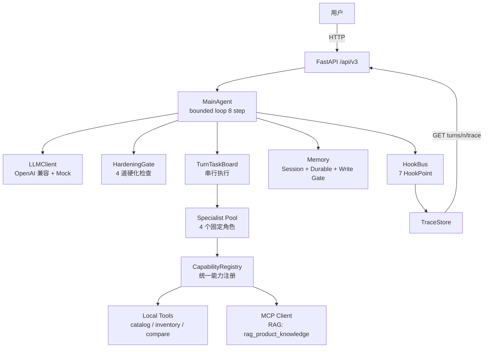

# 中心化 Main-Agent 电商导购平台 (V3)

一个**按 Anthropic Harness 方法论**构建的多 Agent 系统。用户只与 Main Agent 对话,Specialist / Tool / MCP 全部通过统一的 CapabilityRegistry 调度;turn 内串行、多步有界、证据可追溯、行为受 HardeningGate 硬化。

电商导购是 V3.0 的**最小可用场景** — 底层是一个**业务无关**的中心化 Agent Runtime,同一套 Main Agent + Specialist + TaskBoard + Trace + Hook 协议,可以迁移到"多智能体虚拟组织 / 办公协同 / 数据分析"等任意多 Agent 协作领域。

## 架构一览



更详细的设计见 [docs/architecture.md](docs/architecture.md),完整 spec 见 [docs/app_spec.md](docs/app_spec.md)。

## 6 个工程化亮点

1. **Bounded Main-Agent Loop (≤ 8 步)** — [app/v3/agents/main_agent.py](app/v3/agents/main_agent.py)
   `observe → decide → act → observe → ...`,每步走 F08 SerialExecutor,一个 turn 内的 decision / action / observation 形成闭环,避免"放飞"式无限调用。

2. **串行 TaskBoard + ContextPacket 压缩** — [app/v3/runtime/](app/v3/runtime/)
   每个 turn 单独建 TaskBoard,一次只跑一个 ready task;ContextPacketBuilder 在压缩时**丢弃所有 `source=inferred` 的字段**,不让推断升级为"稳定事实"。

3. **HardeningGate 四道检查** — [app/v3/hardening/gate.py](app/v3/hardening/gate.py)
   action whitelist + pydantic schema + evidence rule(reply 承诺的 claim 必须引用某个 `observation_id`)+ business boundary(白名单 topic,越界请求一律 fallback,不走 LLM)。任一失败即整体短路 fallback,trace 写入来源。

4. **两层 Memory + 写入 Gate** — [app/v3/memory/](app/v3/memory/)
   Session(工作记忆,`MappingProxyType` 只读视图)+ Durable(跨会话,**只接受 `source=user_confirmed`**,inferred / tool_fact 一律拒写)。写入均 emit `memory_write` hook。

5. **结构化 JSON 日志 + TraceStore** — [app/v3/observability/logging_config.py](app/v3/observability/logging_config.py) + [app/v3/runtime/trace_store.py](app/v3/runtime/trace_store.py)
   每条日志带 `trace_id / session_id / turn_number / event / payload`;每个 turn 的 decision / invocation / fallback 全部落盘 TraceRecord,外部可通过 `GET /api/v3/sessions/{id}/turns/{n}/trace` 读取完整决策链。

6. **MCP 客户端 + Mock Server** — [app/v3/tools/mcp_client.py](app/v3/tools/mcp_client.py) + [app/v3/tools/mcp_mock_server/](app/v3/tools/mcp_mock_server/)
   外部知识(RAG 风格)通过 **MCP 协议**接入,V3.0 用内置 mock server(同进程 asyncio,接口对齐 MCP `tools.list / tools.call`);生产替换只改 `MCPClient` transport,上层 specialist 代码不动。

此外还有:[CapabilityRegistry](app/v3/registry/capability_registry.py) 统一注册本地 tool / sub-agent / MCP tool、[HookBus](app/v3/hooks/hook_bus.py) 7 HookPoint observer-only pub-sub、[PromptRegistry](app/v3/prompts/registry.py) 4 层分层组装(platform > scenario > role > task_brief)。

## 快速启动

首次本地设置:

```bash
python -m venv .venv
./.venv/Scripts/python.exe -m pip install -U pip
./.venv/Scripts/python.exe -m pip install -r requirements.txt
```

自检 harness 工作区:

```bash
./.venv/Scripts/python.exe harness/v3/bootstrap.py
```

跑全套测试(114 个):

```bash
./.venv/Scripts/python.exe -m pytest tests/v3 -q
```

启动服务:

```bash
./.venv/Scripts/python.exe -m uvicorn app.main:app --host 0.0.0.0 --port 8000
```

## 演示场景

3 个 smoke 场景(code in [tests/v3/smoke/](tests/v3/smoke/)),均可通过 HTTP API 跑通:

| 场景 | 入口 | 验证点 |
|---|---|---|
| Happy Path | "1500 内通勤降噪耳机" | 多步推理 → specialist 协作 → 推荐 + 证据链 |
| Clarification | 模糊的"给朋友挑礼物" | Main Agent 优先澄清 + 槽位追问 |
| Fallback | "我要直接下单" / "帮我退货" | HardeningGate 触发 business boundary fallback |

3 个 HTTP 端点(详见 [app/v3/api/](app/v3/api/)):

- `POST /api/v3/sessions` — 创建 session
- `POST /api/v3/sessions/{id}/messages` — 驱动一个 turn,返回 reply + trace_id
- `GET /api/v3/sessions/{id}/turns/{n}/trace` — 读完整 turn trace

## 项目结构

```
app/
  main.py              FastAPI create_app()
  v3/
    agents/            MainAgent + LLMClient (F09)
    api/               3 HTTP endpoints + middleware (F14)
    config/            pydantic-settings ECOV3_ 前缀 (F01)
    hardening/         HardeningGate 4 检查 (F07)
    hooks/             HookBus 7 HookPoint (F04)
    memory/            Session + Durable + 写入 gate (F05)
    models/            32 个核心 Pydantic 类型 + Action 联合 (F02)
    observability/     JSON logging + trace-id (F15)
    permissions/       PermissionPolicy (F07)
    prompts/           4 层 PromptRegistry (F06)
    registry/          CapabilityRegistry + Provider 抽象 (F03)
    runtime/           TaskBoard + ContextPacket + Executor + TraceStore (F08)
    specialists/       Specialist 基类 + 4 领域 specialist (F10/F13)
    tools/             本地工具 + MCP 客户端 + Mock server (F11/F12)
harness/v3/            feature_list / progress / validation_matrix / bootstrap
docs/                  V3 spec + architecture
tests/v3/              每个 feature 的测试 + 3 个 smoke 场景
archive/legacy-v1-v2/  V1 (DAG 多 Agent) + V2 (ShoppingManager) 完整归档
```

## 技术栈

- Python 3.11+ / FastAPI / Pydantic v2 / httpx / asyncio
- pytest + pytest-asyncio (114 tests)
- OpenAI 兼容 LLM 接口(mock fallback)
- MCP 协议(同进程 mock server + 可替换 transport)

## 与 V1 / V2 的演进

| 版本 | 架构范式 | 场景 |
|---|---|---|
| V1 | DAG 多 Agent(固定 Supervisor 编排) | 单次推荐 API |
| V2 | ShoppingManager(中心化 runtime + 画像投影) | 导购聊天 + 首页推荐 |
| **V3** | **Main Agent + bounded loop + fixed specialist + hardening gate** | **多 Agent 协作平台(电商导购为首个场景)** |

V1 / V2 完整源码、文档、压测结果归档在 [archive/legacy-v1-v2/](archive/legacy-v1-v2/),保留作对比参考,**V3 不复用 V1/V2 基类**。

## 技术约束与 Harness 契约

- [CLAUDE.md](CLAUDE.md) — V3 的硬性技术约束(并发 / 数据传递 / Hardening / Memory 写入 / 外部依赖 / 测试 / 日志 / Trace)
- [harness/v3/feature_list.json](harness/v3/feature_list.json) — 15 个 V3 feature + 验收标准 + spec 锚点
- [harness/v3/claude-progress.txt](harness/v3/claude-progress.txt) — 每轮 coding agent 交接
- [harness/v3/validation_matrix.json](harness/v3/validation_matrix.json) — 每个 feature 的确定性验证入口

每轮 `/code` 从 fresh coding-agent session 开始,只实现一个 feature;所有 bootstrap / pytest / uvicorn 命令统一通过仓库本地 `.venv` 执行。

## 相关项目

作者另一项目 **InfiniteChat**(Spring Boot / Netty / RocketMQ / Redis)—— 面向高频 IM 场景的分布式后端,994 RPS / P99 80ms,在消息可靠性、会话有序、红包事务等维度落地了系统工程能力。与本仓库的 AI 工程能力形成互补。
