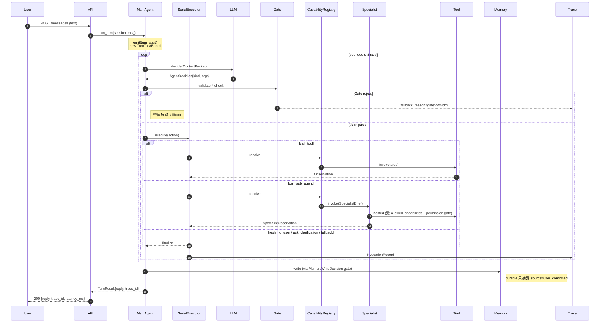

# V3 架构设计

> 完整需求 spec 见 [app_spec.md](app_spec.md)。本文是对 spec 的工程化剖面:它怎么跑、为什么这样拆、边界在哪。

## 设计目标(Why V3)

V3 要解决 V1 DAG 和 V2 ShoppingManager 在实际使用中的三个结构性问题:

1. **不可预期的行为边界** — V2 没有统一的 action 集合,worker 可以直接写 reply。V3 把 Main Agent 的动作收敛成 **5 种 Action 的 discriminated union**(`reply_to_user / ask_clarification / call_tool / call_sub_agent / fallback`),所有决策要能反序列化为其中一种,否则 fallback。
2. **幻觉与推断污染** — V2 里 LLM 生成的 inferred 字段可以直接写进用户画像。V3 加入 **HardeningGate 四道检查** + **MemoryWriteDecision**,reply 的 claim 必须能 map 到 `observation_id`,durable 记忆只接受 `source=user_confirmed` 的条目。
3. **多 Agent 耦合与不可追踪** — V2 的 worker 之间可以互相调用。V3 规定**所有能力(本地 tool / sub-agent / MCP tool)必须通过 CapabilityRegistry 统一注册**,turn 内**串行执行**,每个 decision / invocation / fallback 落盘 TraceStore。

## 系统分层

```
┌───────────────────────────────────────────────────────────────┐
│  API 层 (F14): 3 端点 + X-Trace-ID + latency_ms              │
├───────────────────────────────────────────────────────────────┤
│  Agent 层 (F09): MainAgent bounded loop ≤ 8 step              │
│    ├── LLMClient (OpenAI 兼容 + mock fallback)                │
│    └── AgentDecision → Action (discriminated union)           │
├───────────────────────────────────────────────────────────────┤
│  Runtime 层 (F08): SerialExecutor + TurnTaskBoard + Trace     │
│    ├── ContextPacketBuilder (丢弃 inferred)                   │
│    └── TraceStore (turn-level 决策链)                         │
├───────────────────────────────────────────────────────────────┤
│  Hardening 层 (F07): Gate + PermissionPolicy                  │
│    ├── action whitelist  (5 种 action)                        │
│    ├── schema validation (Pydantic)                           │
│    ├── evidence rule     (claim → observation_id)             │
│    └── business boundary (5 个白名单 topic)                   │
├───────────────────────────────────────────────────────────────┤
│  Specialist 层 (F10 + F13): 4 个固定角色                      │
│    ├── ShoppingBrief (槽位收集)                               │
│    ├── CandidateAnalysis (候选打分 + 证据)                    │
│    ├── Comparison (6 维度白名单对比)                          │
│    └── RecommendationRationale (推荐理由 + RAG)               │
├───────────────────────────────────────────────────────────────┤
│  Capability 层 (F03 + F11 + F12): 统一注册中心                │
│    ├── Local Tools: catalog_search / inventory_check /        │
│    │                product_compare                           │
│    └── MCP Tools:   rag_product_knowledge (mock server)       │
├───────────────────────────────────────────────────────────────┤
│  Memory 层 (F05): Session + Durable + 写入 gate               │
│  Prompt 层 (F06): 4 层 (platform > scenario > role > task)    │
│  Hook 层 (F04): 7 HookPoint observer-only                     │
│  Observability 层 (F15): JSON logs + trace-id 贯穿            │
└───────────────────────────────────────────────────────────────┘
```

## Turn 内时序

一次 `POST /api/v3/sessions/{id}/messages` 的完整时序:



## 关键协议

### Action Set(5 种)

LLM 输出必须反序列化为下列之一(`kind` 字段判别):

| Action | 用途 | Gate 关注点 |
|---|---|---|
| `reply_to_user` | 回复用户 | evidence rule(claim → observation_id) |
| `ask_clarification` | 追问槽位 | business boundary(topic 白名单) |
| `call_tool` | 调本地 tool / MCP tool | permission + schema |
| `call_sub_agent` | 调 specialist | permission + brief schema |
| `fallback` | 受控降级 | 总是放行,写 `fallback_reason` |

详见 [app/v3/models/decision.py](../app/v3/models/decision.py) 的 `ACTION_TYPE_ADAPTER`。

### CapabilityDescriptor

所有可调能力(本地 tool / specialist / MCP tool)通过 `CapabilityDescriptor` 描述:

```python
CapabilityDescriptor(
    name="catalog_search",
    kind=CapabilityKind.tool,       # tool | sub_agent | mcp_tool
    input_schema={...},             # JSON schema subset
    output_schema={...},
    timeout=2.0,
    permission_tag="catalog.read",  # 用于 PermissionPolicy
)
```

Provider 抽象见 [app/v3/registry/providers.py](../app/v3/registry/providers.py):

- `ToolProvider.invoke(args) -> Observation`
- `SubAgentProvider.invoke(brief) -> SpecialistObservation`
- `MCPProvider`(继承 ToolProvider,语义对齐 MCP `tools.call`)

### HookPoint(7 个)

| HookPoint | 触发时机 |
|---|---|
| `turn_start` | MainAgent 收到用户消息,建 TaskBoard 之前 |
| `decision` | LLM 返回 AgentDecision,过 gate 之前 |
| `task` | TurnTask 状态迁移(pending/ready/running/done/failed/blocked) |
| `invocation` | 每次 tool / sub-agent 调用完成(含成功/失败) |
| `memory_write` | DurableMemory / SessionMemory 写入(不论 allow/deny) |
| `fallback` | Gate reject 或 LLM 显式输出 fallback |
| `turn_end` | Turn 结束,Trace 落盘后 |

Hook **observer-only**:handler 修改 event 只记 warning 并丢弃变更;handler 抛异常被隔离,不影响其他 handler。

### Memory 写入 Gate

`MemoryWriteDecision.evaluate(entry)`:

| `entry.source` | Session | Durable |
|---|---|---|
| `user_confirmed` | ✅ | ✅ |
| `tool_fact` | ✅ | ❌ |
| `inferred` | ✅(只读视图) | ❌ |

### 4 层 Prompt 组装

```
┌──────────────────┐  ← 最高优先级,下层不可覆盖
│ platform         │  (业务边界 / hardening 硬规则)
├──────────────────┤
│ scenario         │  (电商导购 / 办公协同 / ...)
├──────────────────┤
│ role             │  (shopping_brief / candidate_analysis / ...)
├──────────────────┤
│ task_brief       │  (当前 turn 具体任务)
└──────────────────┘
```

## 扩展点

### 加新场景

1. 在 [app/v3/specialists/](../app/v3/specialists/) 新增 4 个领域 specialist(继承 `Specialist` 基类,每个注册一个 role prompt)
2. 在 [app/v3/tools/](../app/v3/tools/) 新增工具 Provider(实现 `ToolProvider`)
3. 在 [app/v3/prompts/](../app/v3/prompts/) 注册 scenario prompt
4. 在 `create_app()` 里把新 capability 注册进 `CapabilityRegistry`
5. **Main Agent / HardeningGate / TraceStore / HookBus 完全不用动**

### 加 MCP tool(外部 RAG / 文档 / 知识库)

1. 定义 MCP server(或接真实 MCP server)
2. 在 [app/v3/tools/mcp_provider.py](../app/v3/tools/mcp_provider.py) 注册
3. 换 transport(目前是 `InProcessMCPTransport`,生产替换为 HTTP/stdio transport)
4. specialist 侧无感知:MCP tool 和本地 tool 走同一个 `CapabilityRegistry.invoke` 入口

## 边界与限制(V3.0 显式不支持)

- **persistent_teammate / dynamic_fork** — V3.1 / V3.2 才做,当前 spec 明确禁止实现
- **单轮 turn 内并行 task** — 所有 task 串行,`asyncio.gather` 只用于 Main Agent 自身的 decision 阶段
- **真实商品交易** — 下单 / 支付 / 物流 / 售后全部 fallback,V3.0 只做导购
- **真实 Redis / 向量库** — 全部 mock(session memory 是进程内 dict,MCP server 是同进程 asyncio)
- **LLM 纠错重试** — gate / schema 失败直接 fallback,不走 LLM 自修正(避免放大幻觉)

## 验证入口

```bash
# 1. 工作区自检
./.venv/Scripts/python.exe harness/v3/bootstrap.py

# 2. 全套单元测试 + smoke (114 test)
./.venv/Scripts/python.exe -m pytest tests/v3 -q

# 3. 启动服务,实际交互
./.venv/Scripts/python.exe -m uvicorn app.main:app --port 8000

# 4. 读 turn trace
curl http://localhost:8000/api/v3/sessions/<sid>/turns/1/trace
```

## 进一步阅读

- [app_spec.md](app_spec.md) — 完整需求规格(~32 个核心类型 + 非功能要求)
- [../CLAUDE.md](../CLAUDE.md) — 硬性技术约束(并发 / 数据 / Hardening / Memory / Logging / Trace)
- [../harness/v3/feature_list.json](../harness/v3/feature_list.json) — 15 个 feature 的 scope / acceptance_criteria / spec_reference
- [../harness/v3/claude-progress.txt](../harness/v3/claude-progress.txt) — 每个 feature 实现时的关键决策记录
